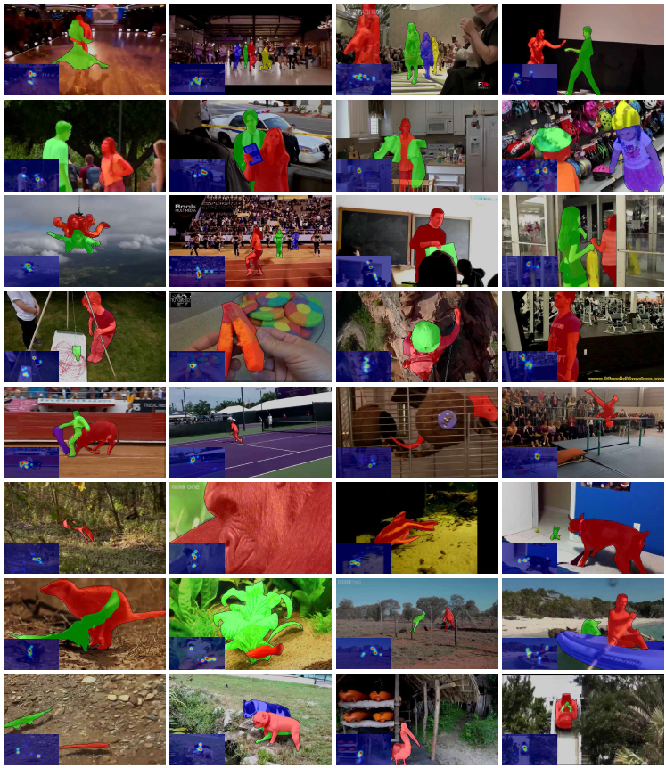

# SSAV (CVPR2019-Oral) <a name="headin"></a>

Code for paper in CVPR2019, 'Shifting More Attention to Video Salient Object Detection'

> **Authors:**
> [Deng-Ping Fan]([https://dpfan.net/](https://dengpingfan.github.io/)), 
> [Wenguan Wang](https://github.com/wenguanwang), 
> [Ming-Ming Cheng](http://mmcheng.net), 
> [Jianbing Shen](http://iitlab.bit.edu.cn/mcislab/~shenjianbing/).


**Paper with code**: https://paperswithcode.com/task/video-salient-object-detection 

<p align="center">
     <br />
    <em> 
    Figure 1: OVerall architecture of the proposed SSAV model.
    </em>
</p>

### Table of Contents
- [SSAV (CVPR2019-Oral) <a name="headin"></a>](#ssav-cvpr2019-oral-)
		- [Table of Contents](#table-of-contents)
	- [Abstract](#abstract)
	- [Notion of saliency shift](#notion-of-saliency-shift)
	- [Statistics of DAVSOD](#statistics-of-davsod)
	- [Downloads](#downloads)
	- [Usage](#usage)
	- [Results](#results)
	- [Citation](#citation)

## Abstract
The last decade has witnessed a growing interest in video salient object detection (VSOD). However, the research community long-term lacked a well-established VSOD dataset representative of real dynamic scenes with high-quality annotations. To address this issue, we elaborately collected a visual-attention-consistent Densely Annotated VSOD (DAVSOD) dataset, which contains 226 videos with 23,938 frames that cover diverse realistic-scenes, objects, instances and motions. With corresponding real human eye-fixation data, we obtain precise ground-truths. This is the first work that explicitly emphasizes the challenge of saliency shift, i.e., the video salient object(s) may dynamically change. To further contribute the community a complete benchmark, we systematically assess 17 representative VSOD algorithms over seven existing VSOD datasets and our DAVSOD with totally ~84K frames (largest-scale). Utilizing three famous metrics, we then present a comprehensive and insightful performance analysis. Furthermore, we propose a baseline model. It is equipped with a saliencyshift-aware convLSTM, which can efficiently capture video saliency dynamics through learning human attention-shift behavior. Extensive experiments1 open up promising future directions for model development and comparison.


## Notion of saliency shift
The saliency shift is not just represented as a binary signal, w.r.t., whether it happens in a certain frame. Since we focus on an object-level task, we change the saliency values of different objects according to the shift of human attention. The rich annotations, including saliency shift, object-/instance-level ground-truths (GT), salient object numbers, scene/object categories, and camera/object motions, provide a solid foundation for VSOD task and benefit a wide range of potential applications.

<p align="center">
     <br />
    <em> 
    Figure 2: Annotation examples of our DAVSOD dataset.
    </em>
</p>


## Statistics of DAVSOD
<p align="center">
     <br />
    <em> 
    Figure 3: Statistics of the proposed DAVSOD dataset.
    </em>
</p>

Figure 3 shows (a) Scene/object categories. (b, c) Distribution of annotated instances and image frames, respectively. (d) Ratio distribution of the objects/instances. (e) Mutual dependencies among scene categories in (a).


## Downloads
1. **DAVSOD dataset.** 
   - Training Set (3.05G, 61 sequences)  | [Baidu  Pan](https://pan.baidu.com/s/1gwflPRUk2pxWAj6jFAZxYQ)(fetch code: wvi3) | [Google Drive](https://drive.google.com/drive/folders/1_seEomJRkLWipHyEl28FQfmjbma-v0_8?usp=sharing) (**Updated link: 2021-02-18**)
   - Validation Set (2.30G, 46 sequences)  | [Baidu  Pan](https://pan.baidu.com/s/1YMxk7MTzxm-mrW92kmmveg)(fetch code: 9tbb) | [Google Drive](https://drive.google.com/drive/folders/1nJ3LhgKOE-Dy73sslxTlD8aSxufC3eQw?usp=sharing) (**Updated link: 2021-02-18**)
   - Test Set (4.89G, 80 sequences) | [Baidu Pan](https://pan.baidu.com/s/1A29Cf-KdCBA1dbxXodCg4Q) | [Google Drive](https://drive.google.com/drive/folders/18nCaMmLBzwAiNslODiPXMsKyP-qX0pi0?usp=sharing) (**Updated link: 2021-02-18**) 
     - Easy-35 (2.08G, 35 sequences,  tested in CVPR’19) | [Baidu  Pan](https://pan.baidu.com/s/1OtmI_eclQo9oD4IQY8p4OQ)(fetch code: v5ss) | [Google Drive](https://drive.google.com/file/d/1hwlb1t7S_Zahp6GSKW9qlRMQh7lMUhph/view?usp=sharing) (**Updated link: 2021-02-18**)
     - Normal-25 (1.42G, 25 sequences)   | [Baidu  Pan](https://pan.baidu.com/s/1QdWUy3vUbw1dkpitUoCqpw)| [Google Drive](https://drive.google.com/file/d/1bclC888a-3yXc-yTVB5PPnwyPiPi2hNJ/view?usp=sharing) (**Updated link: 2021-02-18**)
     - Difficult-20 (1.38G, 20 sequences)  | [Baidu  Pan](https://pan.baidu.com/s/1GcZp_R3KkgSdWItJCcJyjA) | [Google Drive](https://drive.google.com/file/d/1ZHf3y96tF7m92L08DnctI3uRh7h-gZo9/view?usp=sharing) (**Updated link: 2021-02-18**)
   - video description, name, attributes: [DAVSOD-name.xlsx](http://dpfan.net/wp-content/uploads/DAVSOD-name.xlsx) (old version) | [DAVSOD-name-v2.xlsx](http://dpfan.net/wp-content/uploads/DAVSOD-name-v2.xlsx) ( **Updated**: **2019-9-11**) | [DAVSOD-Statistics.xlsx](http://dpfan.net/wp-content/uploads/Taxonomy.xlsx) (old version) | [DAVSOD-Statistics-v2.xlsx](http://dpfan.net/wp-content/uploads/Taxonomy-v2.xlsx) (**Updated**: **2019-9-11**)

	**Note**: 
	- The [DAVSOD-name-v2.xlsx](http://dpfan.net/wp-content/uploads/DAVSOD-name-v2.xlsx) deleted some description of missing videos (0124、0291、0413、0556). Some video like 0189\_1 share with the same attributes with 0189. These shared videos including: 0064\_1, 0066\_1, 0182\_1, 0189\_1, 0256\_1, 0616\_1, 0675\_1, 0345\_1, 0590\_2, 0318\_1, 0328\_1, 0590\_1, 0194\_1, 0321\_1, 0590\_3
	- we merge the small sequence of the training set. Thus, there are only 61 sequences which are different from the CVPR 2019 paper (90 training sequences).


1. **SSAV model.** 
   - caffe version: [https://github.com/DengPingFan/DAVSOD](https://github.com/DengPingFan/DAVSOD)
   - pytorch version: coming soon.
   - Tensorflow version:  coming soon.


1. **Popular Existing Datasets.**

	Previous datasets have different formats, causing laborious data preprocessing when training or testing. Here we unified the format of all the datasets for easier use:
	
   	- original images saved as \*.jpg format 
   	- original images indexd of zero (e.g., 00000.jpg)
   	- ground-truth images saved as \*.png format

	|**Year**|**Publisher**|**Dataset**|**Clips**|**Download Link1**|**Download Link2**|
	| :-: | :-: | :-: | :-: | :-: | :-: |
	|2010|BMVC|**SegV1**|5(11.9MB)|[Baidu Pan](https://pan.baidu.com/s/1UQ0Lhoc94xwCL0dDUcFQYw)|[Google Driver](https://drive.google.com/open?id=12OslUpBZ61fNh48ksQYp43mt46gxj7k7)|
	|2013|ICCV|**SegV2**|14(84.9MB)|[Baidu Pan](https://pan.baidu.com/s/1MywImBeU644Z_qfwUwAxdg)|[Google Driver](https://drive.google.com/open?id=1xQznG6etAtbNEjb1R2ZbjXDD4RCWTHax)|
	|2014|TPAMI|**FBMS**|30 (790MB)|[Baidu Pan](https://pan.baidu.com/s/1KwW2-FlF-mkTRD5JRu_aNg)|[Google Driver](https://drive.google.com/open?id=1fOkBR_l1YzZ_eDojDa50ZLD-8Nv5OnJ3)|
	|2014|TPAMI|FBMS-59 (overall)|59(817.52MB)|[Baidu Pan](https://pan.baidu.com/s/159WtwxYy3ZDo1kg_K90ogQ)|[Google Driver](https://drive.google.com/open?id=1nmJVBvSRIi-OBaYvDl6PXb5xirENG9F-)|
	|2015|TIP|**MCL**|9(308MB)|[Baidu Pan](https://pan.baidu.com/s/1OH9FhK74Km5GM46FZmotwA)|[Google Driver](https://drive.google.com/open?id=1DGrIJM660zj6k67Mfgv7z3K2uIQnVaCs)|
	|2015|TIP|**ViSal**|17(59.1MB)|[Baidu Pan](https://pan.baidu.com/s/1s7OwV_wv6VUJV0DBN7Ot8A)|[Google Driver](https://drive.google.com/open?id=1q7I0srSSrlj-78aInbUpPqhHrcdxTZUt)|
	|2016|CVPR|**DAVIS**|50(842MB)|[Baidu Pan](https://pan.baidu.com/s/1SlrLuviBez1AkpNl-MzQtA)|[Google Driver](https://drive.google.com/open?id=1slc9rE6stq8ASyl0Mocznx6PLvu_zxOc)|
	|2017|TCSVT|**UVSD**|18(207MB)|[Baidu Pan](https://pan.baidu.com/s/1OL6-kOg6y0GPk_pf4ZJ1sw)|[Google Driver](https://drive.google.com/open?id=18Rv4xycxp7MLQHFliuDWUdcRxw2mQOsO)|
	|2018|TIP|[**VOS**](http://dpfan.net/wp-content/uploads/2018TIPVOSA-Benchmark-Dataset-and-Saliency-guided-Stacked-Autoencoders-for-Video-based-Salient-Object-Detection.pdf)|200(3.33GB)|Baidu Pan|Google Driver|
	|||**VOS\_test**|40(672MB)|[Baidu Pan](https://pan.baidu.com/s/1C1-Zf54Uqor8foaVMgq6xQ)|[Google Driver](https://drive.google.com/open?id=1ld3zHXjMO0I9OJAtIa6Ux-0UA1XfB7dG)|
	|2019|CVPR|**DAVSOD**|187(10.24G)|[Baidu Pan](https://pan.baidu.com/s/164sajEdC10-LOxGjCnEuUw) (fetch code: ivzo)|[Google Driver](https://drive.google.com/drive/folders/1BnDF7nB9gPFibx5a8XW5QMc-uyZTTNdA)|
	|||All datasets |||[Google Driver](https://drive.google.com/open?id=1AgDKaFESTwpRESqT3XecvWUNHxQYsLg1)


	\* We do not include the “penguin sequence” of the SegTrack-V2 dataset due to its inaccurate segmentation. Thus the results of the MCL dataset only contains 13 sequences in our benchmark. For VOS dataset, we only benchmark the test sequence divided by our benchmark (Traning Set: Val Set: Test Set = 6:2:2).

1. **Papers & Codes & Results (continue updating).**

We have spent about **half a year** to execute all of the codes. You can download all the results directly for the convience of research. Please cite our paper if you use our results. The overall results link is here ([Baidu](https://pan.baidu.com/s/1ORJg2X4t6OFl-fYlEUcPvw)|Google)  **(Update: 2019-11-17)**	
	
|**Year & Pub & Paper**|**Model**|**DAVIS**|**FBMS**|**MCL**|**SegV1**|**SegV2**|**UVSD**|**ViSal**|**VOS**|**DAVSOD & Overall**|
| :-: | :-: | :-: | :-: | :-: | :-: | :-: | :-: | :-: | :-: | :-: |
|2008 & CVPR & [**PQFT**](http://dpfan.net/wp-content/uploads/2008CVPR%E3%80%90PGFT%E3%80%91Spatio-temporal-Saliency-Detection-Using-Phase-Spectrum-of-Quaternion-Fourier-Transform.pdf)|[Code](http://dpfan.net/wp-content/uploads/2008-CVPR-PQFT.zip)|[Baidu ](https://pan.baidu.com/s/1T6RD6gDmZRhdqeMfIp2aMQ)\| Google|[Baidu ](https://pan.baidu.com/s/1Ab0ex7YK0cMgRHPbgkNiYw)\| Google|[Baidu ](https://pan.baidu.com/s/1xrLthuxOpw6t1rPG--x1xA)\| Google|[Baidu ](https://pan.baidu.com/s/1StnLc4X2LvOqG2DRet4jeA)\| Google|[Baidu ](https://pan.baidu.com/s/13g7RsXMmzYVL6_BBgZC5ow)\| Google|[Baidu ](https://pan.baidu.com/s/1MczGKR1inm8DySUVei-kDg)\| Google|[Baidu ](https://pan.baidu.com/s/1Lh-jnPdOPFu61NN2QPsgfw)\| Google|[Baidu](https://pan.baidu.com/s/1WB0lRQLSQYylRf8RqgtVkw) \| Google|[Baidu ](https://pan.baidu.com/s/1n15KvcC5g1mPsvXKpp5U5w)\| Google|
|2009 & JOV & [**SST**](http://dpfan.net/wp-content/uploads/2009JOVSSTStatic-and-Space-time-Visual-Saliency-Detection-by-Self-Resemblance.pdf)|[Code](http://dpfan.net/wp-content/uploads/2009-JOV-SST.zip)|[Baidu ](https://pan.baidu.com/s/1TBVqzCB7c1sG2DHmyu-D4Q)\| Google|[Baidu ](https://pan.baidu.com/s/19GqLH1wYdFcvCXjXp7IsNA)\| Google|[Baidu ](https://pan.baidu.com/s/1arnIiFBV-gfoKdVpEl0miA)\| Google|[Baidu ](https://pan.baidu.com/s/1sS7YlS4lNAnX4WV5cGJFFQ)\| Google|[Baidu ](https://pan.baidu.com/s/1_ngJQfKK7ZKuJxte5cPq9Q)\| Google|[Baidu ](https://pan.baidu.com/s/1epAaC6GbCFkhGVq5mIJbsg)\| Google|[Baidu ](https://pan.baidu.com/s/157jLf2roSvlXsDPZ5Zbyxg)\| Google|[Baidu ](https://pan.baidu.com/s/1ALW2n1ThQ_TJgM18l933FA)\| Google|[Baidu ](https://pan.baidu.com/s/1O3wBq3wZJxx-9wNvWMej4w)\| Google|
|2010 & ECCV & [**SIVM**](http://dpfan.net/wp-content/uploads/2010ECCVSIVSegmenting-Salient-Objects-from-Images-and-Videos.pdf)|Code|[Baidu](https://pan.baidu.com/s/12fYTWtuOTe1refKt_qkZUg) \| Google|[Baidu](https://pan.baidu.com/s/1YkCjHTLG910H0EijJIQjWQ) \| Google|[Baidu](https://pan.baidu.com/s/15tpcXdkcWtkQ2oeENBgP0w) \| Google|[Baidu](https://pan.baidu.com/s/1x9tjEPpeH1fQNjkn17Fh-w) \| Google|[Baidu](https://pan.baidu.com/s/1rVZC_aNmw99D_PyUZ548Wg) \| Google|[Baidu](https://pan.baidu.com/s/1OfgeBaVOy7vVo5jNcfjIHw) \| Google|[Baidu](https://pan.baidu.com/s/1Yl_bPRrTnnCjtA5Erbs88g) \| Google|[Baidu](https://pan.baidu.com/s/1yOpkOn7PziogwHxvTUtqJw) \| Google|[Baidu](https://pan.baidu.com/s/1X5SysUkVXGuURvDjY3-BVg) \| Google|
|2014 & CVPR & [**TIMP**](http://dpfan.net/wp-content/uploads/2014CVPRTIMPTime-Mapping-Using-Space-Time-Saliency.pdf)|[Code](http://dpfan.net/wp-content/uploads/2014-CVPR-TIMP.zip)|[Baidu ](https://pan.baidu.com/s/12XB0NlAX1fw8yxSOrSlvSg)\| Google|[Baidu ](https://pan.baidu.com/s/1UWWbFzoz9vUazQHdsFskGg)\| Google|[Baidu ](https://pan.baidu.com/s/1Xb4JfLDxf4uBMH6aLmi3gA)\| Google|[Baidu ](https://pan.baidu.com/s/1ys3Zju3GHwR64cNB19ZDew)\| Google|[Baidu ](https://pan.baidu.com/s/1z8XCcO79hEOe9zsRAimvAQ)\| Google|[Baidu ](https://pan.baidu.com/s/16aUN7UsBDPv7VP-rn6F1hw)\| Google|[Baidu ](https://pan.baidu.com/s/1hvtVFOlwowfS2tQZ4aDADA)\| Google|Baidu \| Google|[Baidu ](https://pan.baidu.com/s/1GA0hp7_1iVB-RkcLc5oA-w)\| Google|
|2014 & TCSVT & [SPVM](http://dpfan.net/wp-content/uploads/2014TCSVTSPSuperpixel-Based-Spatiotemporal-Saliency-Detection.pdf)|[Code](http://www.ivp.shu.edu.cn/Default.aspx?tabid=33430)|[Baidu](https://pan.baidu.com/s/1rYIOt79nsyLrDEIzvpKfeQ) \| Google|[Baidu ](https://pan.baidu.com/s/1-hjZ3OjRQlCZkTxd51uZ5A)\| Google|[Baidu](https://pan.baidu.com/s/1Vpc3ICd6j3lzBMaN1Ayl9A) \| Google|[Baidu](https://pan.baidu.com/s/1kLD9Qepc9ilHDLiuSnHJsw) \| Google|[Baidu](https://pan.baidu.com/s/1-4cvt4qOtoJk8Vl0-LaPDg) \| Google|[Baidu](https://pan.baidu.com/s/1-kuRgB4hUbFY8gqqEhV9_A) \| Google|[Baidu](https://pan.baidu.com/s/1YCPQ4_sDUomxEGjivO_j1w) \| Google|[Baidu](https://pan.baidu.com/s/1vkBMMMY2C4TYh7cgJ--1cw) \| Google|[Baidu](https://pan.baidu.com/s/1tmqCvj84-vHJfH5mPnAL2w) \| Google|
|2015 & CVPR & [**SAG**](http://dpfan.net/wp-content/uploads/2015CVPRSAGSaliency-Aware-Geodesic-Video-Object-Segmentation.pdf)|[Code](http://dpfan.net/wp-content/uploads/2015-CVPR-SAG.zip)|[Baidu](https://pan.baidu.com/s/1JbKHX1LPnIxp8TzDys1H9Q) \| Google|[Baidu](https://pan.baidu.com/s/17sYQTV6i9fdapP61PJyL7w) \| Google|[Baidu](https://pan.baidu.com/s/19_nwWB9g9-4lo9sxkp_dMg) \| Google|[Baidu](https://pan.baidu.com/s/1nMvFloed3rIguxfN7HMMQQ) \| Google|[Baidu](https://pan.baidu.com/s/1u5BtxnNU5gdnV2qZgK5hpw) \| Google|[Baidu](https://pan.baidu.com/s/1dP1LS0pJUvk3j977wqvASA) \| Google|[Baidu](https://pan.baidu.com/s/1HR0p5lf__WTvhIvm45-Ozg) \| Google|[Baidu ](https://pan.baidu.com/s/1XMhAs7PNdVsqGbNLgC-GVQ)\| Google|[Baidu](https://pan.baidu.com/s/1-msJI7SH8OGJPckm0nveTw) \| Google|
|2015 & TIP & [**GFVM**](http://dpfan.net/wp-content/uploads/2015TIPGFConsistent-Video-Saliency-Using-Local-Gradient-Flow-Optimization-and-Global-Refinement.pdf)|[Code](http://dpfan.net/wp-content/uploads/2015-TIP-GF.zip)|[Baidu ](https://pan.baidu.com/s/1slpDlCtxQYsINcofcYAF_Q)\| Google|[Baidu ](https://pan.baidu.com/s/1AuBa7R0Gyurpz1AkkXGQjw)\| Google|[Baidu ](https://pan.baidu.com/s/10JWi4u3xu-_xJTcM7w3kqw)\| Google|[Baidu ](https://pan.baidu.com/s/1aD0i8qEjygHCB5gfvdKchg)\| Google|[Baidu ](https://pan.baidu.com/s/1ltsWU251lhcMZBbJFlwBiA)\| Google|[Baidu ](https://pan.baidu.com/s/1fr7WfoO4LJOjXVCs3iJqMw)\| Google|[Baidu ](https://pan.baidu.com/s/1CngJSfTaMA-rTJE__Eu0UA)\| Google|[Baidu](https://pan.baidu.com/s/1TJPpQBv2iLWLNzqmOA7Efw) \| Google|[Baidu ](https://pan.baidu.com/s/1F7JB8ielAhxtUjKM6RJgLg)\| Google|
|2015 & TIP & [**RWRV**](http://dpfan.net/wp-content/uploads/2015TIPRWRVSpatiotemporal-Saliency-Detection-for-Video-Sequences-Based-on-Random-Walk-With-Restart.pdf)|[Code](http://dpfan.net/wp-content/uploads/2015-TIP-RWRV.zip)|[Baidu](https://pan.baidu.com/s/1OFk9VU-l4iKPO52Op_QQ9Q) \| Google|[Baidu ](https://pan.baidu.com/s/1m-Fc46vIC6jFFqoOhHsr2w)\| Google|[Baidu ](https://pan.baidu.com/s/14Gu3zwzOEKLabN8hfXzXsA)\| Google|[Baidu ](https://pan.baidu.com/s/1Php8bwSuyhQcizAbhZG_tQ)\| Google|[Baidu ](https://pan.baidu.com/s/1Q4Cx3P5MzLXzEe1sP3Q5bw)\| Google|[Baidu ](https://pan.baidu.com/s/1S1lK3ztwn7v8lkO3c9sJaA)\| Google|[Baidu ](https://pan.baidu.com/s/1DPfiZU_E3Hp5b25hCM2IYQ)\| Google|Baidu \| Google|[Baidu ](https://pan.baidu.com/s/1dnHRpuupw3MzZc9urkGmyQ)\| Google|
|2015 & ICCV & [**MB+**](http://dpfan.net/wp-content/uploads/2015ICCVMBMinimum-Barrier-Salient-Object-Detection-at-80-FPS.pdf)|[Code](http://dpfan.net/wp-content/uploads/2015-ICCV-MB.zip)|[Baidu ](https://pan.baidu.com/s/10qwpbMWM34lU4sCx6aIGlw)\| Google|[Baidu ](https://pan.baidu.com/s/1ezk2LErJXl8FkHsxG-1hmg)\| Google|[Baidu ](https://pan.baidu.com/s/1REcf0wCn0BFdl--kgwhQwQ)\| Google|[Baidu ](https://pan.baidu.com/s/1NDPnHwgIvOXjJorvyNXmBQ)\| Google|[Baidu ](https://pan.baidu.com/s/1agZu8i-lAEny3a5d-qIwBg)\| Google|[Baidu ](https://pan.baidu.com/s/1QouyBqX9JBQr13IpkWIUdg)\| Google|[Baidu ](https://pan.baidu.com/s/1XaVROnM1T5IsffuRKd2H8g)\| Google|[Baidu](https://pan.baidu.com/s/1vwqvz9mklpnVvDqkcpxYqg) \| Google|[Baidu](https://pan.baidu.com/s/1pcE3IauG9msxo1fFgNnXww) \| Google|
|2016 & CVPR & [**MST**](http://dpfan.net/wp-content/uploads/2016CVPRMSTReal-Time-Salient-Object-Detection-with-a-Minimum-Spanning-Tree.pdf)|[Code](http://dpfan.net/wp-content/uploads/2016-CVPR-MST.zip)|[Baidu ](https://pan.baidu.com/s/1Iuw0m98VWN11RhrMBZhm5w)\| Google|[Baidu ](https://pan.baidu.com/s/1J5U3wYDc5rTf6o9y7TjR5Q)\| Google|[Baidu ](https://pan.baidu.com/s/1FVFoZ8yqvPvUbP00d19pwA)\| Google|[Baidu ](https://pan.baidu.com/s/13BxXddZABL3dOsy4PNdbLA)\| Google|[Baidu ](https://pan.baidu.com/s/1ZsXsOiL7bG25sv95qmcyWA)\| Google|[Baidu ](https://pan.baidu.com/s/1GZnT7kUzWKQfppHE_Yt_Ew)\| Google|[Baidu ](https://pan.baidu.com/s/1vubZMP07xzuVKqAf6G4Uig)\| Google|Baidu \| Google|[Baidu ](https://pan.baidu.com/s/1_bXM4RwmnW2D9-WxNoOgNQ)\| Google|
|2017 & TCSVT & [**SGSP**](http://dpfan.net/wp-content/uploads/2017TCSVTSGSPSaliency-detection-for-unconstrained-videos-using-superpixel-level-graph-and-spatiotemporal-propagation.pdf)|[Code](http://dpfan.net/wp-content/uploads/2017-TCSVT-SGSP.zip)|[Baidu ](https://pan.baidu.com/s/1Gdbe6iA9xxHtCeqGqVB4jA)\| Google|[Baidu](https://pan.baidu.com/s/15oB6popPFXMSAfu7B4XjDg) \| Google|[Baidu](https://pan.baidu.com/s/19FcD5l0Q_D-Vsx3_0jRtTw) \| Google|[Baidu ](https://pan.baidu.com/s/113ud0kItXh4ymMWWGNgXJA)\| Google|[Baidu](https://pan.baidu.com/s/1aJp3rAwGNTprJ0InG3Bg_A) \| Google|[Baidu](https://pan.baidu.com/s/159yrO_NAYVJaj4vL-Wbptw) \| Google|[Baidu](https://pan.baidu.com/s/1f1JncdJt9Uw8pouzi2IH6Q) \| Google|Baidu \| Google|[Baidu ](https://pan.baidu.com/s/1HgolmWU5jiQuqnpjybb6HA)\| Google|
|2017 & TIP & [**SFLR**](http://dpfan.net/wp-content/uploads/2017TIPSFLRVideo-Saliency-Detection-via-Spatial-Temporal-Fusion-and-Low-Rank-Coherency-Diffusion.pdf)|[Code](http://dpfan.net/wp-content/uploads/2017-TIP-SFLR.zip)|[Baidu ](https://pan.baidu.com/s/13HsCPkj1inDRlFqlUvphPQ)\| Google|[Baidu ](https://pan.baidu.com/s/1iYo2CkUZ5uqTLGcCNzC_xQ)\| Google|[Baidu ](https://pan.baidu.com/s/1lKt0GOjo2iHK3cmcksjD-g)\| Google|[Baidu](https://pan.baidu.com/s/11tetJ9zGOPlXCaQG1hlPZA) \| Google|[Baidu](https://pan.baidu.com/s/1NCXwXT8yojQDhmT0eYWNRg) \| Google|[Baidu ](https://pan.baidu.com/s/1MFSbWwvaNPr1pXHMoiYhUQ)\| Google|[Baidu ](https://pan.baidu.com/s/1NL6Wh9ORdiADlSS9JwSbIA)\| Google|Baidu \| Google|[Baidu ](https://pan.baidu.com/s/1KWfqRiX7bAypVbAcRo2obA)\| Google|
|2017 & TIP & [**STBP**](http://dpfan.net/wp-content/uploads/2017TIPSTBPSalient-Object-Detection-with-Spatiotemporal-Background-Priors-for-Video.pdf)|[Code](http://dpfan.net/wp-content/uploads/2017-TIP-STBP.zip)|[Baidu](https://pan.baidu.com/s/1Rp-vjSsQmbGDVbSxzHix6w) \| Google|[Baidu](https://pan.baidu.com/s/1dXaXXBULN_UzN_uP_fQS7A) \| Google|[Baidu](https://pan.baidu.com/s/1XfazOGVf8JtyisREL5QBZw) \| Google|[Baidu](https://pan.baidu.com/s/1QUdtszAo-gyM-pHcl7MWkw) \| Google|[Baidu](https://pan.baidu.com/s/1xgmO_4MNZzR6LTZF_0sdsQ) \| Google|[Baidu](https://pan.baidu.com/s/15rgNIZE-J_U9wlpq5IfKig) \| Google|[Baidu](https://pan.baidu.com/s/1qeIHKGsnIFW1VO7Gye8m0A) \| Google|[Baidu](https://pan.baidu.com/s/1NoEg_q7vvGcAGvpT8xVRMA) \| Google|[Baidu](https://pan.baidu.com/s/1Bmmr4LseJ8szTxSkCicjBw) \| Google|	
|2017 & TCYB & [**VSOP**](http://dpfan.net/wp-content/uploads/2018TCYBVSOPVideo-Saliency-Detection-Using-Object-Proposals.pdf)|Code|Baidu \| Google|[Baidu](https://pan.baidu.com/s/1LORMlb9GsbGVALIrg78BIA) \| Google|Baidu \| Google|[Baidu](https://pan.baidu.com/s/1-Y3NU2fNcZA8ah2FD6UZwA) \| Google|[Baidu](https://pan.baidu.com/s/19_3ExixqkmbHkHSrLmtQ3w) \| Google|Baidu \| Google|Baidu \| Google|Baidu \| Google|[Baidu](https://pan.baidu.com/s/1flgYj0wk3M4gyDRq-dN8Zg) \| Google|
|2017 & BMVC & [DSR3D](http://dpfan.net/wp-content/uploads/2017BMVCDSR3DDeeply-Supervised-3D-Recurrent-FCN-for-Salient-Object-Detection-in-Videos.pdf)|Code|[Baidu](https://pan.baidu.com/s/1aM_qg-ziV50RvKxIBksqpA) \| Google|Baidu \| Google|Baidu \| Google|[Baidu ](https://pan.baidu.com/s/1At3-EVrreq6_E0BjMZeZDA)\| Google|[Baidu ](https://pan.baidu.com/s/1_dZb4O_D_w-8NQs-bvnzBQ)\| Google|Baidu \| Google|Baidu \| Google|Baidu \| Google|[Baidu](https://pan.baidu.com/s/1GPksEm5qMMGkXkq9Q3lZMA) \| Google|
|2018 & TIP & [STCRF](http://dpfan.net/wp-content/uploads/2018TIPSTCRFVideo-Salient-Object-Detection-Using-Spatiotemporal-Deep-Features.pdf)|Code|[Baidu ](https://pan.baidu.com/s/1J2Mdjqm4AQ3V0fY_74mgHA)\| Google|Baidu \| Google|Baidu \| Google|[Baidu](https://pan.baidu.com/s/11DhzbVbBmzQDgibcqVuRBA) \| Google|[Baidu ](https://pan.baidu.com/s/1JzNghWK8cB5sFU-HzEH7-g)\| Google|Baidu \| Google|Baidu \| Google|Baidu \| Google|[Baidu ](https://pan.baidu.com/s/1C9DiAKewBlHjUe3h2A_AQA)\| Google|
|2018 & TIP & [**SCOM**](http://dpfan.net/wp-content/uploads/2018TIPSCOMSpatiotemporal-Constrained-Optimization-for-Salient-Object-Detection.pdf)|Code|[Baidu](https://pan.baidu.com/s/1Vf9O9q-ysCltwsNYP_y9NA) \| Google|[Baidu](https://pan.baidu.com/s/18kXmpovp1QzOwvw-LQ5GAQ) \| Google|[Baidu](https://pan.baidu.com/s/1bUy5-ZwCZijUSH3tfgGR7A) \| Google|[Baidu](https://pan.baidu.com/s/1jtkcsT1RXRsSFpGQMPIY6g) \| Google|[Baidu](https://pan.baidu.com/s/1GyyDG0bCjS9xHkPtuDEhXw) \| Google|[Baidu](https://pan.baidu.com/s/1Oed8jLGXWj9RAdhgweDxwg) \| Google|[Baidu](https://pan.baidu.com/s/18pNd6wu42obtDhbTnsklgQ) \| Google|[Baidu](https://pan.baidu.com/s/1FRiquB-R-uIcJs_N0f9W_w) \| Google|[Baidu](https://pan.baidu.com/s/11-SQ5dpKvcBKGUTbQuDPDg) \| Google|
|2018 & TIP & [**DLVSD**](http://dpfan.net/wp-content/uploads/2018TIPDLVSDVideo-Salient-Object-Detection-via-Fully-Convolutional-Networks.pdf)|[Code](http://dpfan.net/wp-content/uploads/2018-TIP-DLVSD.zip)|[Baidu ](https://pan.baidu.com/s/19m8TOa5tvny8lBRAv66mbg)\| Google|[Baidu](https://pan.baidu.com/s/1ajSaTaNH2VVCo5MnKz_hdw) \| Google|[Baidu](https://pan.baidu.com/s/1igOKvOhz6F4jsAKyWLPiYA) \| Google|[Baidu ](https://pan.baidu.com/s/1WMkRg35GrO-YsZDQG4-_Fw)\| Google|[Baidu](https://pan.baidu.com/s/1eJQ_LPnSi8XvlLEmASvcKg) \| Google|[Baidu](https://pan.baidu.com/s/1VbcHq7m7dLGU4nf7qSWh9w) \| Google|[Baidu ](https://pan.baidu.com/s/1Zcv1D6XALO0Dd9iyBFCBMw)\| Google|[Baidu](https://pan.baidu.com/s/1NW8tZrbLwed1_SgkMFQo-g) \| Google|[Baidu ](https://pan.baidu.com/s/1FUb8UvIQxp3GqQmADbdjlg)\| Google|
|2018 & TCSVT & SCNN|Code|[Baidu](https://pan.baidu.com/s/1I8XptKLIseyNG70vIC4YRA) \| Google|[Baidu](https://pan.baidu.com/s/1ozfR2QgGkrAxiloBAeABgw) \| Google|[Baidu](https://pan.baidu.com/s/1qvJiDmBQQFLyTuWNMd6oVg) \| Google|Baidu \| Google|Baidu \| Google|[Baidu](https://pan.baidu.com/s/1kkjigLljmXeWplNs8fPdEA) \| Google|[Baidu](https://pan.baidu.com/s/1h-EfXCWdZl1_dW7TwTmBzw) \| Google|[Baidu](https://pan.baidu.com/s/1-KbOoIKoNM3s34zZTCMOWQ) \| Google|[Baidu](https://pan.baidu.com/s/1LiNYmKOpi0FsxenBwDLQGg) \| Google|
|2018 & ECCV & MBNM|Code|[Baidu](https://pan.baidu.com/s/1lX1ZFUuaPAaMmTcIEaDMow) \| Google|[Baidu](https://pan.baidu.com/s/1x0hGn4p-kTqdzTqbr05icA) \| Google|[Baidu](https://pan.baidu.com/s/1FobuUPQefpgTGn4JOVRLGA) \| Google|Baidu \| Google|[Baidu](https://pan.baidu.com/s/160vf3OAwMqKvNhajH_19Aw) \| Google|[Baidu](https://pan.baidu.com/s/11QnwM2fR7osBMxjaeAjBRQ) \| Google|[Baidu](https://pan.baidu.com/s/1HHjX9XPAK8vnLBtV72YBoA) \| Google|[Baidu](https://pan.baidu.com/s/1ckC0yKs6UpHvKrws60S0Yw) \| Google|[Baidu](https://pan.baidu.com/s/1GKVnO4JoeTiHe-A88mY_yw) \| Google|
|2018 & ECCV & [**PDB**](http://dpfan.net/wp-content/uploads/2018ECCVPDBPyramid-Dilated-Deeper-CoonvLSTM-for-Video-Salient-Object-Detection.pdf)|[Code](https://github.com/wenguanwang/PDB-ConvLSTM)|[Baidu ](https://pan.baidu.com/s/1hdlr28VgOfEtdhiPCBpjPQ)\| Google|[Baidu ](https://pan.baidu.com/s/1Xqv69uOusFxbRSR1WknwmA)\| Google|[Baidu ](https://pan.baidu.com/s/11b6ZA8wrYnIsFJjPkrUciw)\| Google|[Baidu ](https://pan.baidu.com/s/1y-O8C5vGhoiW55F8Cf9PAA)\| Google|[Baidu ](https://pan.baidu.com/s/1JP98bXEq7goAhx-VIJ5B-g)\| Google|[Baidu ](https://pan.baidu.com/s/16DLO54iyFM9j0ksZrB3psg)\| Google|[Baidu](https://pan.baidu.com/s/1t8-Beq_0SNNqhkSTxJlgpw) \| Google|Baidu \| Google|[Baidu](https://pan.baidu.com/s/1pePyRf-a6nW5FYcGeYFvPg) \| Google|
|2018 & CVPR & [**FGRNE**](http://dpfan.net/wp-content/uploads/2018CVPRFGRNE-Flow-Guided-Recurrent-Neural-Encoder-for-Video-Salient-Object-Detection.pdf)|Code|[Baidu](https://pan.baidu.com/s/1FBj2wZwVAZZLoD0f6nun2Q) \| Google|[Baidu](https://pan.baidu.com/s/1pbU0PwKgJ2ZHIlSz2YcUAg) \| Google|[Baidu](https://pan.baidu.com/s/11fBUcVcdtyM2chZLOD33rA) \| Google|[Baidu](https://pan.baidu.com/s/1bnFPdiw1XrzCpEDnfKKJxQ) \| Google|[Baidu](https://pan.baidu.com/s/1QIc0DUr-SfOsL3c98EHr6g) \| Google|[Baidu](https://pan.baidu.com/s/1FXBd6_7g8UeF7C52Os77jQ) \| Google|[Baidu](https://pan.baidu.com/s/1Bu2VvjCYCl1-j1heJxxQdQ) \| Google|[Baidu](https://pan.baidu.com/s/1CQJ4TtvaBEbl197rXQdl7w) \| Google|[Baidu](https://pan.baidu.com/s/147HbNagc0l3mV-mhDdHTSA) \| Google|
|2019 & CVPR & [SSAV](http://openaccess.thecvf.com/content_CVPR_2019/papers/Fan_Shifting_More_Attention_to_Video_Salient_Object_Detection_CVPR_2019_paper.pdf)|[Code](https://github.com/DengPingFan/DAVSOD)|[Baidu](https://pan.baidu.com/s/1qHT4sQBz48TUglbTrJL-6A) \| Google|[Baidu](https://pan.baidu.com/s/1jnSfS-ca8DJ470Pr6z2Ixw) \| Google|[Baidu](https://pan.baidu.com/s/1qGwYaKvA8QDM1rCJDALaTg) \| Google|Baidu \| Google|[Baidu](https://pan.baidu.com/s/1nV-gPic6e5pdqpi51awb5w) \| Google|[Baidu](https://pan.baidu.com/s/1KuwzOFHWo9YUL4RLCk2THA) \| Google|[Baidu](https://pan.baidu.com/s/1kms8c-mgq7dPpkiaHRcIjA) \| Google|[Baidu](https://pan.baidu.com/s/1q5Ge3N_-qtVbgOdSYbQL5w) \| Google|[Baidu](https://pan.baidu.com/s/1p10rDMUh0ydE-Nt1jXd9GQ) \| Google|


## Usage

The code has been tested successfully on Ubuntu 16.04 with CUDA 8.0 and OpenCV 3.1.0

1. Prerequisites: 
	
	Use `DAVSOD/mycaffe-convlstm/Makefile.config` to build caffe. Follow [official instructions](http://caffe.berkeleyvision.org/installation.html).

	```bash
	make all -j8
	make pycaffe
	```

1. Downloading necessary data:

    + downloading the training/testing dataset and move it into `Datasets/`.
    
    + downloading pre-trained caffemodel and move it into `model/`, 
    which can be found in [baidu pan](https://pan.baidu.com/s/1dg_dcgFNOnUubfQev0e4Ag)(Fetch Code: pb0h) | [google drive](https://drive.google.com/open?id=1o9PkfgMpUI8McGSCgWG8cdGJF4dFmHrM). 

1. Testing Configuration:

    + After you download the pre-trained model and testing dataset, 
    just run `generateTestList.py` to get the test list, and `SSAV_test.py` to get the saliency maps in `results/SSAV/`.
    
    + Just enjoy it!
    
    + The prediction results of all competitors and our PNS-Net can be found at [Google Drive (7MB)](https://drive.google.com/file/d/1iCZiTS4n-5ZSnCozLBi-1gpbuzjORx4z/view?usp=sharing).

1. Training Configuration:
    
    + With the training dataset downloaded, you can download the basemodel from [baidu pan](https://pan.baidu.com/s/1qEyXennBYT2yv82bNx5TgA) (Fetch Code:0xk4) | [google drive](https://drive.google.com/file/d/1y6cpqpkAaIzBEHHpWkePTSr9C8Pyk5ND/view?usp=sharing).
    

2. Evaluating model:

	+ One-key evaluation is written in MATLAB code `main.m` in `DAVSOD/EvaluateTool/`. Details of the evaluation metrics please refer to the following papers.
		```
		[1]Structure-measure: A New Way to Evaluate the Foregournd Maps, ICCV2017.
		[2]Enhanced Alignment Measure for Binary Foreground Map Evaluation, IJCAI2018.
		```

---
Note that: This version only provide the **implicit manner** for learning attention-shift. The explicit way to train this model will not be released due to the commercial purposes (Hua Wei, IIAI).

---

## Results
1. **Leaderboard.**
	<p align="center">
		 <br />
		<em>
		Figure 4: Summarizing of 36 previous representative VSOD methods and the proposed SSAV model.
		</em>
	</p>

1. **Benchmark.**
	<p align="center">
		 <br />
		<em>
		Figure 5: Benchmarking results of 17 state-of-the-art VSOD models on 7 datasets.
		</em>
	</p>

1. **Performance Preview**
	<p align="center">
		 <br />
	</p>

	<p align="center">
		 <br />
	</p>

	<p align="center">
		 <br />
		<em>
		Figure 6: Blackswan sequence result generated by our SSAV model. More results can be found in supplemental materials. 
		</em>
	</p>	

1. **DAVSOD Dataset Profile**
	<p align="center">
		 <br />
		<em>
		Figure 7: Samples from our dataset, with instance-level ground truth segmentation and fixation map.
		</em>
	</p>

	<p align="center">
		 <br />
		<em>
		Figure 8: Examples to show our rigorous standards for segmentation labeling.
		</em>
	</p>

	<p align="center">
		 <br />
		<em>
		Figure 9: Example sequence of saliency shift considered in the proposed DAVSOD dataset. Different (5th row) from tradition work which labels all the salient objects (2th row) via static frames. The proposed DAVSOD dataset were strictly annotated according to real human fixation record (3rd row), thus revealing the dynamic human attention mechanism.
		</em>
	</p>

	[](https://youtu.be/NgsDsXDA8Zo)

	<p align="center">
		<em>
		Video for Supplemental Material
		</em>
	</p>


## Citation
If you find this useful, please cite the following works:

```
@InProceedings{Fan_2019_CVPR,
   author = {Fan, Deng-Ping and Wang, Wenguan and Cheng, Ming-Ming and Shen, Jianbing}, 
   title = {Shifting More Attention to Video Salient Object Detection},
   booktitle = {IEEE CVPR},
   year = {2019}
}
@inproceedings{song2018pyramid,
  title={Pyramid dilated deeper ConvLSTM for video salient object detection},
  author={Song, Hongmei and Wang, Wenguan and Zhao, Sanyuan and Shen, Jianbing and Lam, Kin-Man},
  booktitle={ECCV},
  pages={715--731},
  year={2018}
}

```

Contact: Deng-Ping Fan (dengpingfan@mail.nankai.edu.cn).

[⬆ back to top](#headin)
